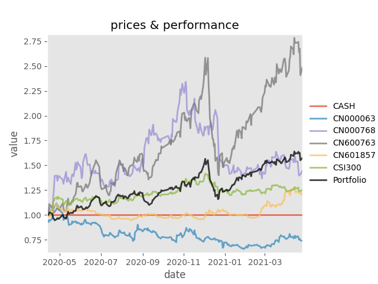
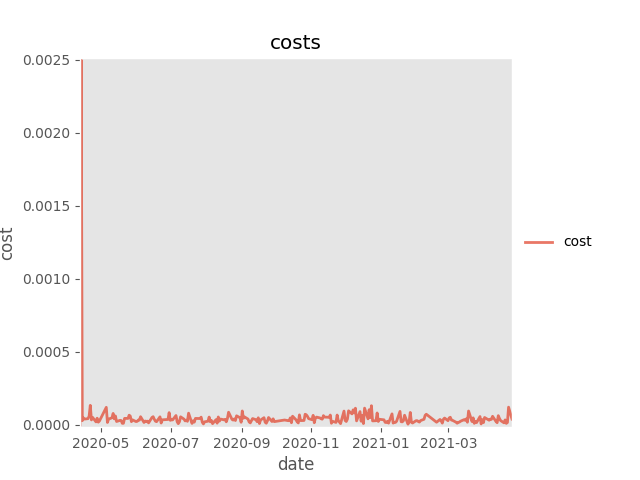

These codes are for our paper which can be found at: https://arxiv.org/abs/2012.13773

Our paper codes based on [wassname's work](https://github.com/wassname/rl-portfolio-management).

Thank 启龙(QQ:823730012), he told us how to modify the code for GPU computing
And Thank Khaman, when discussing in Discord's RL discussion section, he inspire me, makes me think of using MinMax_Normalization to scale the actions.

# Main contribution of our paper
- - -
**We define that all the weights in a portfolio must subject to:**
**,**
It's a very important setting, that makes the calculaiton of portfolio return be very easy when shorting assets, and avoid exaggerating portfolio return in back-testing.

We detail the principle of calculating asset weights when shorting in our paper, it can be see that the calculation of portfolio return is only related to asset weights and asset returns, no matter shorting or longing.

**When leveraging assets in portfolio, the calculation of portfolio is,**

# Experiment Result
- - -

| Training regression line  |  Values in back-test|
|--------|--------|
|  |      |

| Asset weights in back-test | Costs in back-test |
|--------|--------|
|      |      |

**Plesse note, the training rewards had been multiply 10000 times at beginning of the original code, so we divide the training rewards by 10000 in our paper.

| Asset | Daily return (log) | Annual Sharpe (log) | Annual Sortino (log) | MDD |
|:------:|:------:|:------:|:------:|:------:|
| Stochastic portfolio | 0.001792 | 1.653335 | 2.309643 | 25.98% |
| CSI300 | 0.000025 | 0.022390 | 0.035541 | 9.92% |

# Development Environment
- - -
- Operation System -> Ubuntu 18.04, Python version = 3.6, CUDA version = 10.2, pytorch version = 1.5.1
- All the packages that are necessary can be found in the directory: “./requirements”.
- Please note that the neural network in this code only can be run in GPU environment, that means you have to use Nvidia’s graphic card.

However, if you have to only use CPU running this code, you should modify the following pieces of code in pytorch-deeprl-DDPG-arbitrage.ipynb:
1, In Alg section , change q.backward(torch.ones(q.size()).cuda()) to q.backward(torch.ones(q.size()))
2, In Config section, set gpu=False
But it’s not recommended to use CPU running the neural network, otherwise it will be very slow running. Using our 8core/16thread CPU, it will take more than 9 hours to get the results. So, it’s better to use GPU for the neural network.

After running is over, if you want to check the Tensorboard results, please enter the “./runs” directory, then open a Terminal in this directory, and type “tensorboard --logdir='ddpg-xxxxxxxx_xx-xx-xx' ”, you will get it. "ddpg-xxxxxxxx_xx-xx-xx" is the file generated by DRL that you can see in the directory.

# Experimental experience
- - -
- The investment benchmark can be any other assets, not only stock index, so you can set other asset as benchmark and arbitrage.
- As we know, until now there is no neural network framework that specifically used for processing 3-dimensional financial data. Traditional econometric methods reduce the dimensionality of the data, such as PCA used in multi-factor model, which will drop lots of useful information. Therefore, the design of deep neural networks for 3-dimensional financial data is very important, a good deep learning network will greately improve the performance of DRL-portfolio-management model.
- Since our poor equipment and convolution operations require a lot of computing power, we didn't look for extreme backtest performance and perfect strategy generated by DRL. If wanting a perfect DRL strategy which sharpe ratio is above 3, we estimate that the DRL agent should be trained 10 ~ 50 times of 300000 steps, that means at least 10 * 300000 = 3000000 steps.
- DRL belongs to data-driven method. Data is generated by human activities, and human activities are determined by human consciousness. Whoever determines human consciousness will control all the money in the world. So, consciousness is the most important thing.
